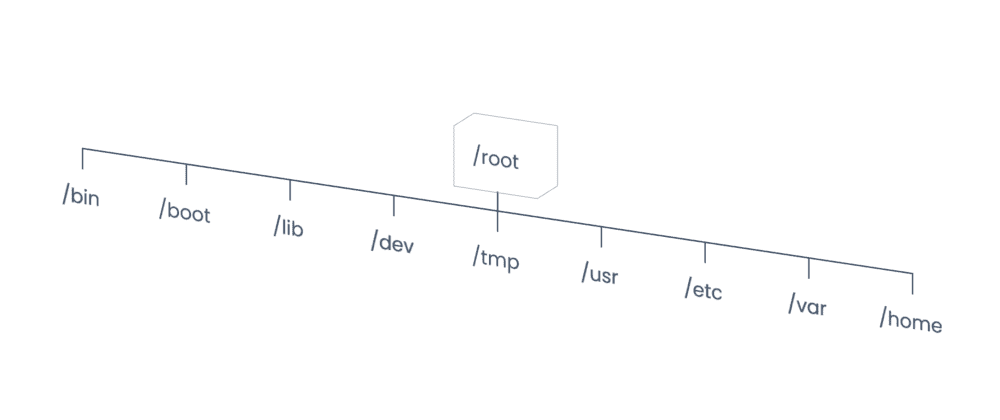

# Operating System 101

- Reference: https://learn.theprogrammingfoundation.org/?

### Unix

- Unix operating system was developed by Ken Thompson, Dennis Ritchie in 1970 at Bell Labs research center
- It was created to be a stable, multi-user and multi-tasking system for desktops and servers.
- Unix Structure:
  - Components
    - Kernel:
      - core of an operating system
      - controls everything in the system
      - kernel remains in the memory until the system is shut down
      - It accesses computer resources
      - Allocates uniform access to all the processes
      - Handles memory management
      - Manages devices
    - Shell:
      - It is interface between the user and the operating system
      - It follows instructions based on the commands given by the user
      - It runs the programs, shell scripts and executes the commands
      - There are different shells like the Bourne shell, Bourne again shell and C shell.
      - The Bash shell shows $ in the prompt: `user@theprogrammingfoundation:~$`
      - The C shell shows % in the prompt: `user@theprogrammingfoundation:~ %`
    - Programs:
      - Programs are logical sequential commands that are developed for specific tasks.
- Unix file structure
  - The UNIX file structure is like an inverted tree and arranged in a hierarchical structure.
  - The top-level of the directory is the root /
  - Root connects the path to other files and directories
  - Each directory has a unique name
  - 

### Unix Shell

- The shell is the interactive command line interface for Unix based operating systems
- The user can type commands to accomplish certain tasks.
- Printing a message:
  - \$ echo "Hello World"
- Clearing the screen
  - \$ clear
- Listing files and directories
  - \$ ls
  - \$ l
  - An alternative to ls is l. This works in many Unix and Unix-like operating systems because l is set as an alias of ls.
- Navigating through directories
  - To go inside a directory: \$ cd <directory_name>
  - The shell prompt shows a / in the beginning of the current directory: ~/Pictures$
  - To list contents of a directory without going inside the directory, type: \$ ls Pictures
- Creating directories and files
  - create a new directory in unix file system : \$ mkdir <directory_name>
  - Multiple directories : \$ mkdir <directory_name1> <directory_name2>
  - NOTE: The shell shows an error if a directory with the same name already exists.
  - create a file in an Unix file system : \$ touch file.txt
  - Multiple files with different extensions can be created using: \$ touch program.c program.java
- Reading files
  - $ cat file.txt
- Removing files and directories
  - Remove a file : $ rm file.txt
  - Remove a directory: rm -r new_directory
  - remove everything inside directory: rm -rf new_directory
- Adding and editing contents of a file
  - CLI editor : GNU nano, Vim or Emacs.
  - To create a file using the text editor **Vim** and add text, type: $ vim file.txt
  - press [Esc], then type :wq to save.
  - Note: In Vim w stands for write and q stands for quit.
- Alias
  - $ alias python="python2" (string python becomes the alias for python2)

---

### Kernel

- The kernel is the core component of an operating system
- It takes complete control over the system by bridging the gap between the users and hardware
- Main tasks of the kernel:
  - Memory Management
  - Device Management
  - Performance Management
  - Resource Management
  - System Management
- Different types of Kernels:
  - Monolithic kernel:
    - Here Kernel and OS share the same memory space.
    - security concern for these machines is less
    - Usually faster than other devices as space is the same
    - NOTE: **Linux is not an operating system. Linux is Monolithic kernel**
  - Microkernel
    - It has minimum components required to build an operating system
  - Hybrid kernel
    - Mix of Microkernel and Monolithic kernel
    - NOTE: **Windows and macOS have Hybrid kernels**
